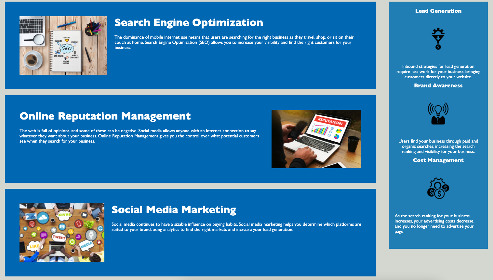

##HOMEWORK1 - Advanced HTML/CSS: Horiseon Coderefactor

The main aim for this project is to make the original code user friendly replacing non-semantic elements for sement elements in the HTML to ensure the website is more accessible. 

Changes added into the code:
- Have added the title "Horiseon" for the tab;
- Have added alt element to all images in the website in order to make accesible for visually impaired users;
- Have fixed bugs in the navigation menu, ensuring all links directed you to the right section.
- In the CSS, have combined when possible elements to avoid duplication;
- In the HTML have added comments;
- In the CSS have added comments explaining fields;
- Have changed the year in the footer with the current year (2021); 

Link to deployed application: https://vicchyx.github.io/horiseon-coderefactor/

Screenshots of project: 

